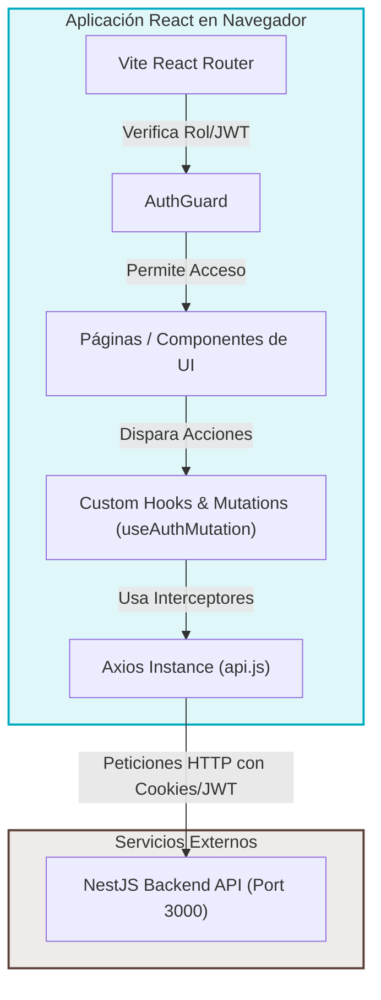

# Rescata - Cliente Frontend 🎨

Este repositorio contiene la aplicación cliente (frontend) para la plataforma **RESCATA**, un sistema diseñado para reducir el desperdicio de alimentos conectando negocios con excedentes de comida y consumidores interesados en adquirirlos a precios reducidos. La aplicación está desarrollada en **React** y construida con **Vite**.

---

## 🗺️ Arquitectura de Software - Frontend

La aplicación frontend sigue una arquitectura modular por características (Feature-Based) y un flujo de datos unidireccional y predecible, interactuando de manera eficiente con el servidor backend mediante llamadas REST seguras.



### Componentes Clave:

- **Vite**: Bundler ultra-rápido para el desarrollo y empaquetamiento del frontend en producción.
- **React Router**: Manejo de rutas estáticas y protegidas mediante Guards para evitar accesos no autorizados a páginas según el rol.
- **Axios Interceptors**: Cliente HTTP configurado para inyectar credenciales (Cookies) y cabeceras necesarias, además de manejar de forma centralizada las respuestas y errores del servidor.
- **Design System**: Estilos premium basados en CSS nativo estructurado y animaciones fluidas para garantizar una gran experiencia de usuario.

---

## 🚀 Instrucciones de Ejecución Local

Sigue estos pasos para levantar la interfaz web en tu entorno local:

### Requisitos Previos:

- [Node.js v22](https://nodejs.org/) instalado.
- Backend de **RESCATA** configurado y en ejecución (con sus contenedores de base de datos Postgres y caché Redis activos).

### Paso 1: Configurar Variables de Entorno

Crea un archivo `.env` en la raíz del frontend (puedes basarte en el archivo existente o simplemente crear uno nuevo):

```env
VITE_API_URL=http://localhost:3000
```

> [!IMPORTANT]
> `VITE_API_URL` debe apuntar al puerto donde el backend NestJS está escuchando (por defecto `http://localhost:3000`).

### Paso 2: Instalar Dependencias del Proyecto

Instala las dependencias necesarias a través de npm:

```bash
npm install
```

### Paso 3: Iniciar el Servidor de Desarrollo

Corre el servidor de desarrollo local usando Vite:

```bash
npm run dev
```

La aplicación web se levantará en `http://localhost:5173`. Abre esta URL en tu navegador.

---

## 🔑 Credenciales de Prueba para Evaluación

Para facilitar la evaluación de la plataforma con diferentes vistas y flujos según el rol, se sugieren los siguientes usuarios de prueba:

| Rol            | Correo Electrónico       | Contraseña     | Permisos y Flujos Asociados                                                                                                                                                                                     |
| :------------- | :----------------------- | :------------- | :-------------------------------------------------------------------------------------------------------------------------------------------------------------------------------------------------------------- |
| **Consumidor** | `consumidor@rescata.com` | `Password123!` | Visualizar productos excedentes de negocios cercanos, realizar reservas/apartados de comida, gestionar sus apartados activos, escribir reseñas (reviews) a los negocios y chatear con el negocio.               |
| **Negocio**    | `negocio@rescata.com`    | `Password123!` | Registrar y gestionar información de la tienda, publicar nuevos productos (precio original, precio oferta, cantidad y caducidad), administrar y confirmar reservas de clientes, y chatear con los consumidores. |

---

## ⚙️ Evidencia de Ejecuciones Exitosas de GitHub Actions

El repositorio frontend cuenta con integración y despliegue continuo (CI/CD) automatizado a través de GitHub Actions, definido en `.github/workflows/deploy.yml`.

Cada vez que se sube un cambio a la rama principal `main`:

1. **Validación**: Se descarga el código, se instalan dependencias limpiamente (`npm ci`), se valida el formateo y linter (`npm run lint`), y se compila el proyecto (`npm run build`).
2. **Despliegue**: Tras pasar las validaciones, se conecta con la CLI de Vercel y despliega de manera automatizada a producción.

El estado en tiempo real y el historial de ejecuciones exitosas de la integración continua se pueden visualizar mediante el siguiente indicador dinámico oficial del workflow:

[]

https://github.com/Rescata-DM-ML/Rescata_Front_DM_ML/actions/workflows/deploy.yml
